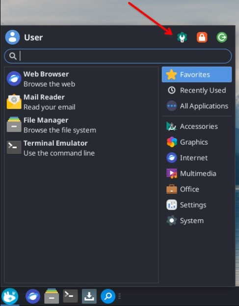
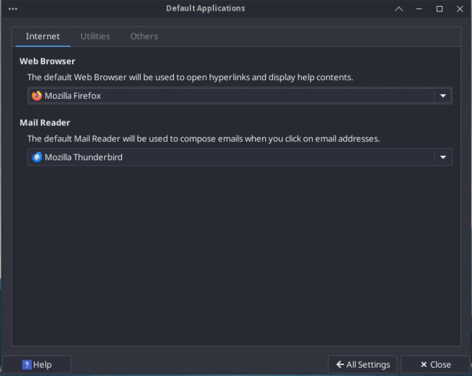
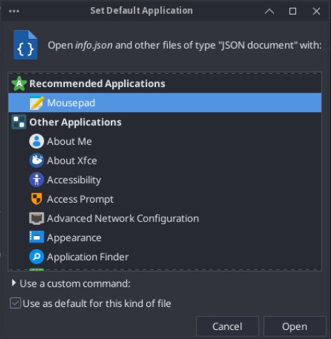

# Configuration

## System settings

You can open the system settings in Solus Xfce using any of the following methods:

- **Application menu**: Open the application menu and select the settings manager icon.

    

- **Application finder**: Press `Alt + F2`, type `xfce4-settings-manager` and press `Enter`.

## Date and time

Solus configures the date and time of your system automatically. If you need to adjust the time and date of your system, use the `timedatectl` utility:

1. Open a terminal.
2. If you want to configure the time and date of your system, execute the following command:
    
    ```bash
    sudo date -s "YYYY-MM-DD HH:MM:SS"
    ```

    The command adjusts the time and date of your system.

3. If you want to configure the timezone of your system, execute the following command:

    ```bash
    sudo timedatectl set-timezone [Time zone]
    ```

    The command changes the timezone of your system and adjusts the time automatically.

    :::tip

    To see the list of available time zones, execute:

    ```bash
    timedatectl list-timezones
    ```

    :::

4. If you want to customize how the time and date display in the bottom panel:
   1. Right-click the clock widget on the bottom panel.
   2. Select **Properties**
   3. Configure the available settings as needed.

## Default applications

## Configure the default applications from the system settings

In the **Settings Manager** screen, select **Default Applications**. Use the available menus to select your preferred default applications.



## Configure the default applications using the file manager

1. Open Thunar.
2. Go to the folder that contains the file you want to open.
3. Right-click the file and select **Set Default Application...**.
4. Choose an application from the list and click **Open**.
    