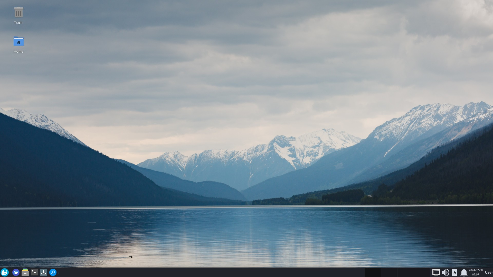

# Xfce

:::warning[Important]

Solus XFCE is in beta.

:::

Xfce is a graphical user interface for Linux distributions that aims to be fast and low on system resources, while visually appealing and user friendly. 

To learn more about the Plasma desktop and KDE, refer to the following pages:

- [Homepage](https://xfce.org)
- [Blog](https://blog.xfce.org)
- [Support](https://gitlab.xfce.org)

---

[Configuration](configuration)

Learn how to customize and configure the Xfce desktop on Solus.

[Tips and Tricks](tips-and-tricks)

Tips and tricks for using Xfce on Solus.