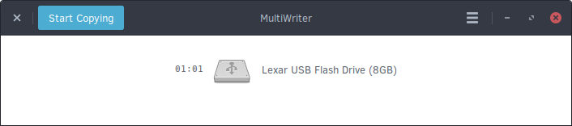
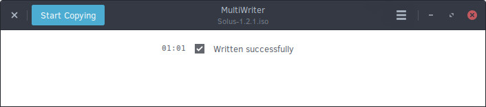
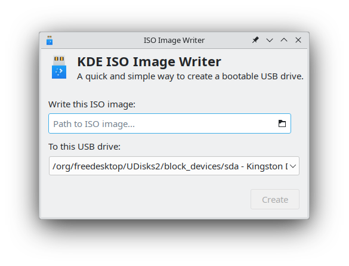
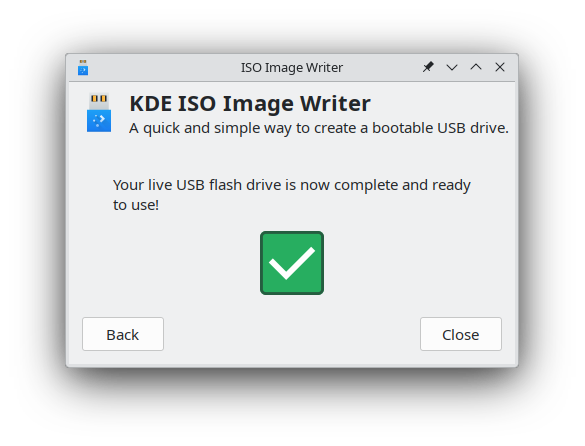

import BeforeYouBegin from '../../../snippets/_createMedia_beforeYouBegin.md'
import USBDataLossWarning from '../../../snippets/_createMedia_dataLossWarning.md'

# Create bootable media - Linux

<BeforeYouBegin />

## DVD

We recommend using [Brasero](https://wiki.gnome.org/Apps/Brasero) for writing the ISO file to a DVD.

1. Insert a blank DVD into your DVD writer.

    Either DVD-R or DVD+RW are ok.
1. Open Brasero.
1. Select **Burn Image**.
1. Select **Click here to select a disc image** and choose the Solus ISO file.
1. Under **Select a disc to write to**, select your DVD drive.
1. Select **Burn**.
    
    Brasero begins creating your bootable DVD.

## USB drive

To create a bootable USB drive in Linux, use [MultiWriter](https://wiki.gnome.org/Apps/MultiWriter) for Gnome or [ISO Image Writer](https://apps.kde.org/isoimagewriter/) for KDE. 

### GNOME MultiWriter

<USBDataLossWarning />

1. Disconnect all USB drives from your computer.
1. Open MultiWriter.
1. When prompted, connect your USB drive to your computer.
1. After MultiWriter displays your USB drive, click **Start Copying**

    
1. In the **Choose the file to write** screen, select the Solus ISO file and click **Import**.

Upon completion, MultiWriter displays the following screen:



### KDE ISO Image Writer

<USBDataLossWarning />

1. Make sure the Solus ISO file and the SHA256SUM files are in the same directory.
1. Disconnect all USB drives from your computer.
1. Open ISO Image Writer.
    
    
1. Connect your USB drive to your computer. 

    ISO Image Writer detects the drive automatically.
1. Click **Path to ISO image...**, then select the Solus ISO image.
1. After ISO Image Writer finishes verifying the ISO image, click **Create**.

Upon completion, ISO Image Writer displays the following screen:



### Command line

<USBDataLossWarning />

1. Disconnect all USB drives from your computer.
1. Open the terminal.
1. Connect your USB drive.
1. Find the identifier of your USB drive.
    
    1. Execute the `lsblk` command.

    The terminal displays a list of all your storage devices.

    ```bash
    $ lsblk

    NAME   MAJ:MIN RM   SIZE RO TYPE MOUNTPOINT
    sda      8:0    0 111.8G  0 disk
    ├─sda1   8:1    0   350M  0 part
    ├─sda2   8:2    0  39.7G  0 part
    └─sda3   8:3    0  71.8G  0 part /
    sdb      8:64   1   7.5G  0 disk
    ├─sdb1   8:65   1   712M  0 part
    └─sdb2   8:66   1  17.2M  0 part
    ```

    2. Find your USB drive in the list. 

    In the list, find the drive that matches the size of your USB drive. In this example, the USB drive is `/dev/sdb`.
1. Go to the folder that contains the Solus ISO file.
    ```bash
    cd /path/to/the/solus/ISO/file/
    ```
1. Use `dd` to write the ISO file to the USB drive.
    
    ```bash
    sudo dd if=<Solus ISO file> of=<USB drive identifier> bs=4M status=progress oflag=sync && sudo eject <USB drive identifier>
    ```

    :::danger[Warning]

    Make sure you select the correct drive when you execute `dd`. Selecting the wrong drive might cause permanent data loss.

    :::

    For example: 

    ```bash
    sudo dd if=Solus-4.5-Budgie.iso of=/dev/sdb bs=4M status=progress oflag=sync && sudo eject /dev/sdb
    ```

    The system automatically ejects your USB drive when the process finishes.