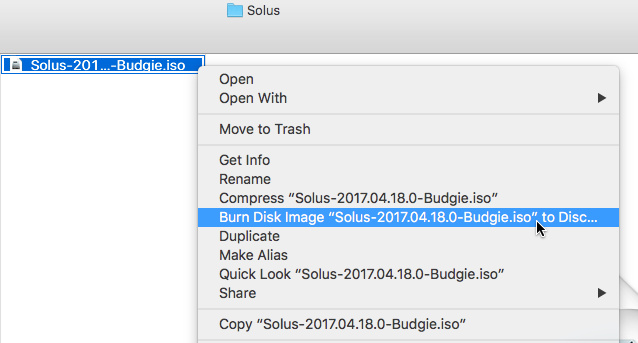

import BeforeYouBegin from '../../../snippets/_createMedia_beforeYouBegin.md'
import USBDataLossWarning from '../../../snippets/_createMedia_dataLossWarning.md'
import BalenaEtcherInstructions from '../../../snippets/_createMedia_balenaEtcher.md'

# Create bootable media - macOS

<BeforeYouBegin />

## DVD

Since OS X El Capitan (10.11), you can use the built-in system tools to create a bootable DVD.

1. Insert a blank DVD into your DVD writer.

   Either DVD-R or DVD+RW are ok.
1. Open Finder.
1. Go to the folder where you downloaded the Solus ISO file.
1. Right-click the ISO image, then select **Burn Disk Image ‘Solus-4.5-Budgie.iso’ to Disc…**
1. Click **Burn**.



## USB drive

### Graphical tool

<USBDataLossWarning />

<BalenaEtcherInstructions os="macOS" />

:::note

After balenaEtcher finishes, you might see a message stating “The disk you inserted was not readable by this computer.” You can ignore the message.

:::

### Command line

<USBDataLossWarning />

1. Disconnect all USB drives from your computer.
1. Open the terminal.
1. Connect your USB drive.
1. Find the identifier of your USB drive.

   1. Execute the `diskutil list` command. 

    The terminal displays a list of all your storage devices.

    ```bash
    $ diskutil list
    
    /dev/disk0 (internal, physical):
    #:                       TYPE NAME                    SIZE       IDENTIFIER
    0:      GUID_partition_scheme                        *1.0 TB     disk0
    1:                        EFI EFI                     209.7 MB   disk0s1
    2:                  Apple_HFS Macintosh HD            999.3 GB   disk0s2
    3:                 Apple_Boot Recovery HD             650.0 MB   disk0s3
    
    /dev/disk1 (external, physical):
    #:                       TYPE NAME                    SIZE       IDENTIFIER
    0:      GUID_partition_scheme                        *15.6 GB    disk1
    1:                        EFI EFI                     209.7 MB   disk1s1
    2:                  Apple_HFS Ultra                   15.3 GB    disk1s2
    ```
   
   2. Find your USB drive in the list. 

    In the list, find the drive that matches the size of your USB drive. In this example, the USB drive is `disk1`.

1. Unmount your USB drive.

    ```bash
    diskutil unmountDisk /dev/<identifier>
    ```

    For example: 

    ```bash
    diskutil unmountDisk /dev/disk1
    ```

1. Go to the folder that contains the Solus ISO file.
    ```bash
    cd /path/to/the/solus/ISO/file/
    ```

1. Use the `dd` command to write the ISO file to the USB drive.
    
    ```bash
    sudo dd if=<Solus ISO file> of=/dev/r<USB drive identifier> bs=1m
    ```
    :::danger[Warning]

    Make sure you select the correct drive when you execute `dd`. Selecting the wrong drive might cause permanent data loss.

    :::

	For example:

    ```bash
    sudo dd if=Solus-4.5-Budgie.iso of=/dev/rdisk1 bs=1m
    ```

1. After the process finishes, eject your USB drive.

    ```bash
    diskutil eject /dev/IDENTIFIER
    ```
