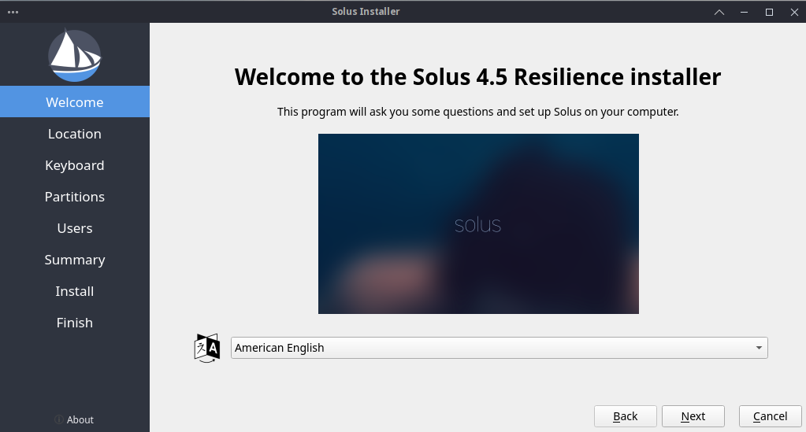
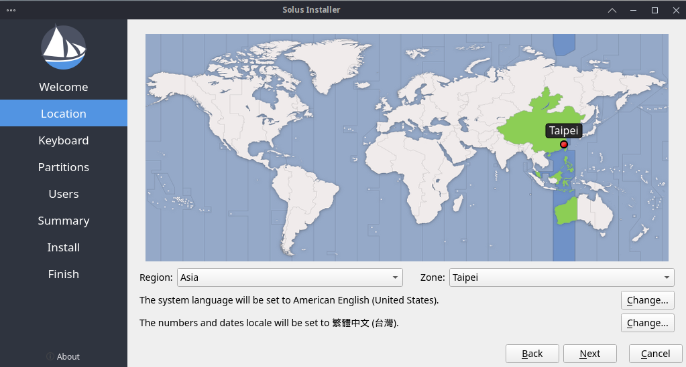
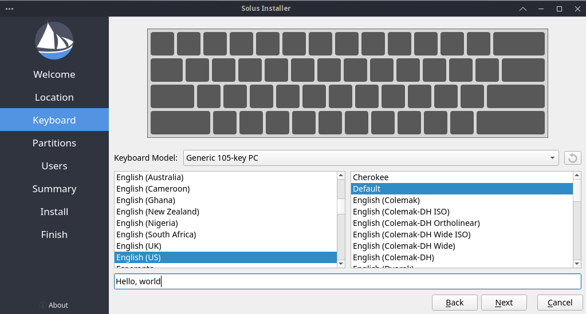
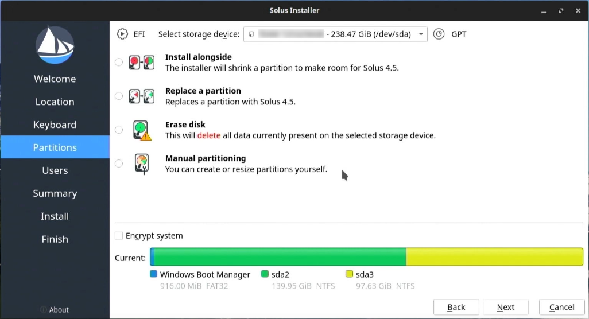
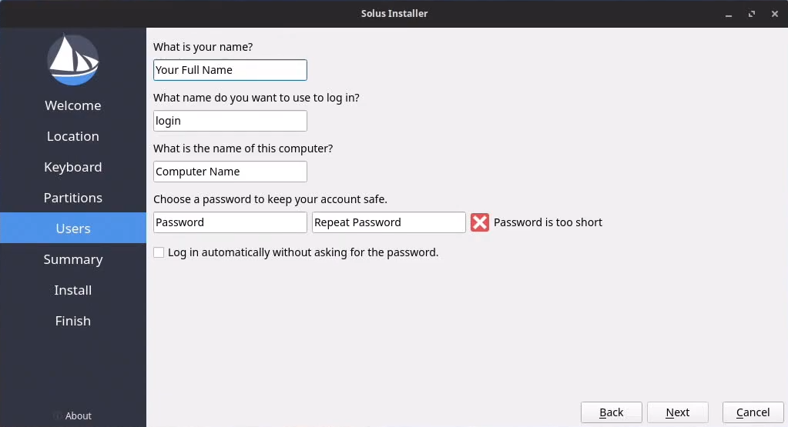
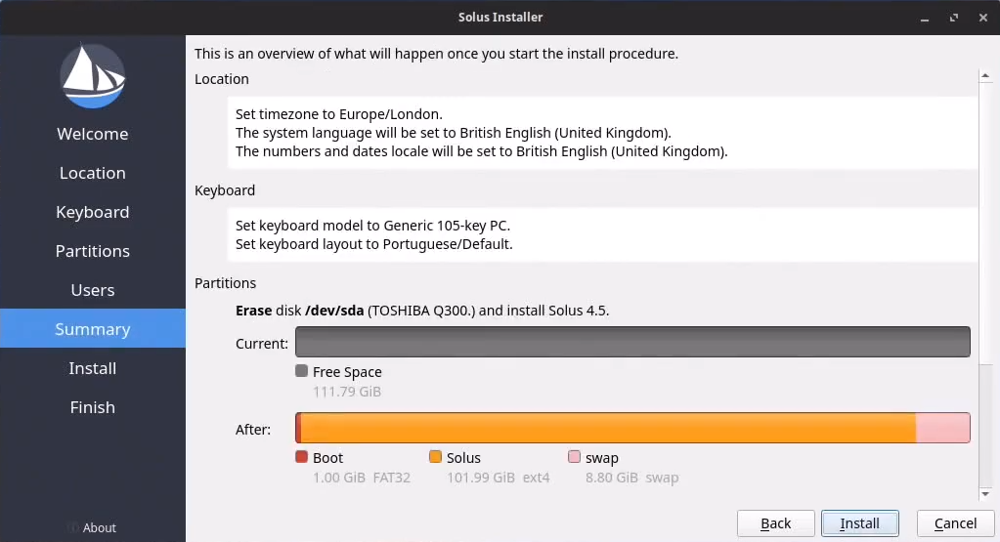

# Install Solus to your computer

:::danger[Warning]

Installing Solus to your computer might cause permanent data loss.

When you install Solus, make sure you select the appropriate drive or backup your files beforehand.

:::

## Welcome screen

The **Welcome** screen lets you select the language the installer uses during the installation process.

If your system does not meet the minimum requirements, the welcome screen displays the issues that you need to fix to install Solus.

## Location

The **Location** screen lets you configure:

- **Region** and **Zone**: Your time zone. Click on your approximate location on the map to configure the region and zone values automatically.
- The system language.
- The locales of your system (date and number formatting, character encoding settings, and so on).

## Keyboard

The **Keyboard** screen lets you configure:

- The physical distribution of your keyboard.
- The keyboard layout Solus will use.

Use the text area on screen to test your keyboard settings.

## Partitions

The **Partitions** screen lets you configure:

- The drive that will be used as the installation target for Solus.
- How the installer will partition your drive.
- Whether you want to encrypt your Solus install.
- The filesystem Solus will use.
- Whether Solus will use a swap partition.

### Partitioning options
The installer provides multiple ways to install Solus on your computer.

- **Install alongside**: Shrinks the largest partition in the target drive and installs Solus there.
- **Replace a partition**: Installs Solus in the partition you select. This is useful if you already created a partition for Solus.
- **Erase disk**: Deletes the contents of the selected drive and installs Solus as the only operating system.
- **Manual partitioning**: If you are an advanced user, you can define your preferred partition scheme to install Solus.

## Users

The **Users** screen lets you configure the admin user account of your system. You can configure more user accounts after Solus installs on your PC.

## Summary

The **Summary** screen displays an overview of the options you selected to install Solus.

If you want to change any options, click **Back**. If you want to begin the installation process, click **Install**.