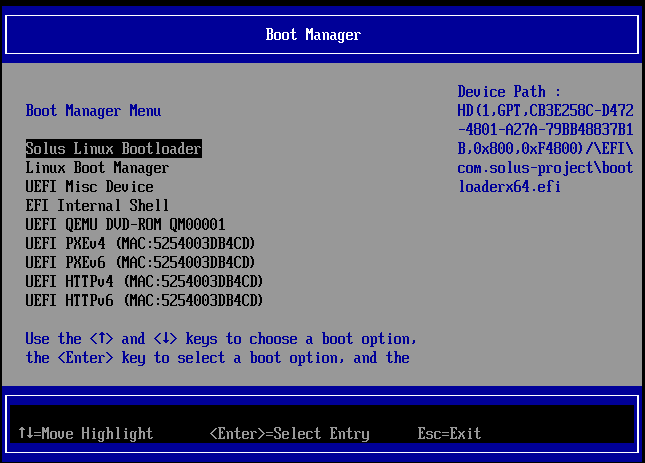
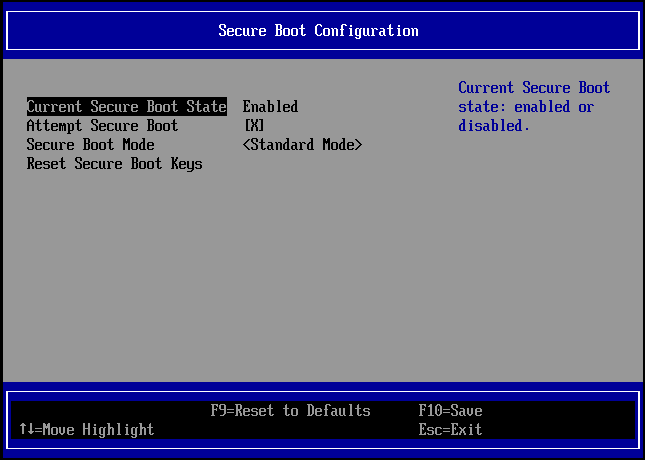

import BiosSpecificInstructions from '../../snippets/secureBoot/_biosSpecificInstructions.md'
import EnrollCertificateGuide from '../../snippets/secureBoot/_enrollCertificateInstructions.md'

# Enable secure boot on an existing Solus install

:::note

This guide applies to computers with UEFI firmware only.

If you want to this step, disable secure boot in your computer's UEFI firmware interface.

:::

1. Confirm that you have version: 3.2.12, release: 29 (or later) of `clr-boot-manager`.

	Execute the following command:
	```bash
	eopkg info clr-boot-manager
    ```

    Recent versions of `clr-boot-manager` create a new UEFI boot entry on your machine called `Solus Linux Bootloader`. This is necessary to boot with Secure Boot enabled.
2. Update the boot manager.
    ```bash
    sudo clr-boot-manager update
    ```

3. Restart your computer and boot from `Solus Linux Bootloader`. 

	1. Restart your computer.
	2. Open the boot selection menu of your computer.

	Common ways to change the menu include pressing the `F2`, `F11`, `F12` or `ESC` keys right after turning on your computer (when the manufacturer logo appears).

    <BiosSpecificInstructions />

	3. Select `Solus Linux Bootloader` from the menu.

	

	Solus starts.

4. In your computer's UEFI configuration screen, enable secure boot.

    1. Open a terminal and execute:

	```bash
    systemctl reboot --firmware-setup
	```
    
	Your system restarts and the UEFI configuration screen appears.
    
	2. Enable secure boot and save your settings.

    The location of the secure boot settings depends on your computer or motherboard. Some common locations are the `Windows OS Configuration`, `Security` or `Device Manager` screens.

    <BiosSpecificInstructions />

    

5. Restart your computer and boot from `Solus Linux Bootloader`. 
6. Enroll the Solus certificate.

    <EnrollCertificateGuide />

7. In your computer's UEFI configuration screen, change the default boot device to `Solus Linux Bootloader`.

Secure boot is enabled and the Solus certificate is enrolled.

:::tip

Verify secure boot is enabled by executing the following command:

```bash
bootctl status | grep "Secure Boot"
```


:::