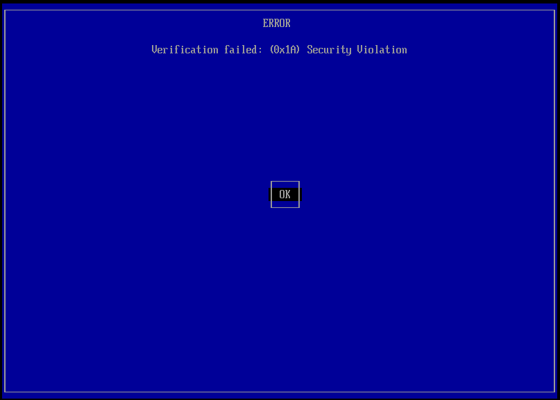
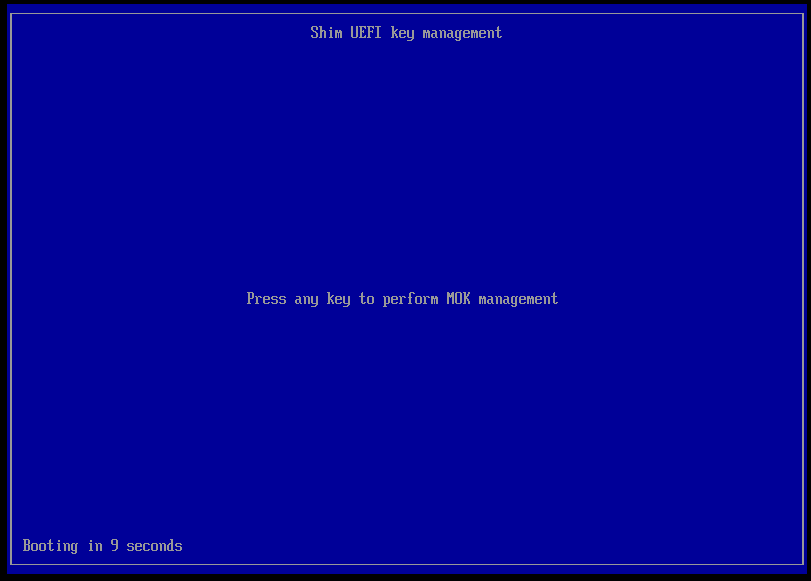
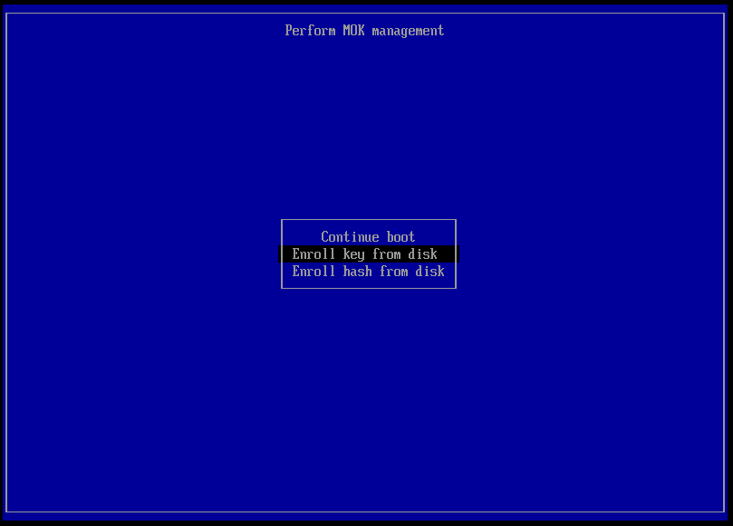
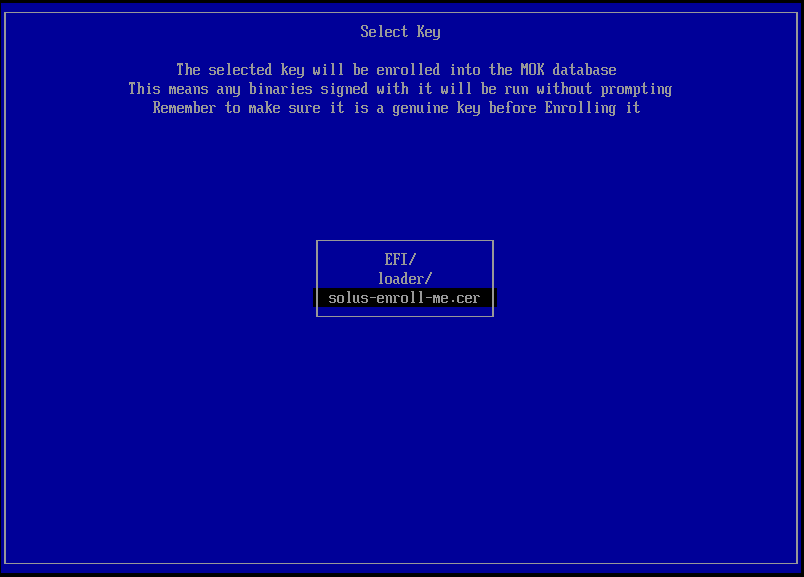
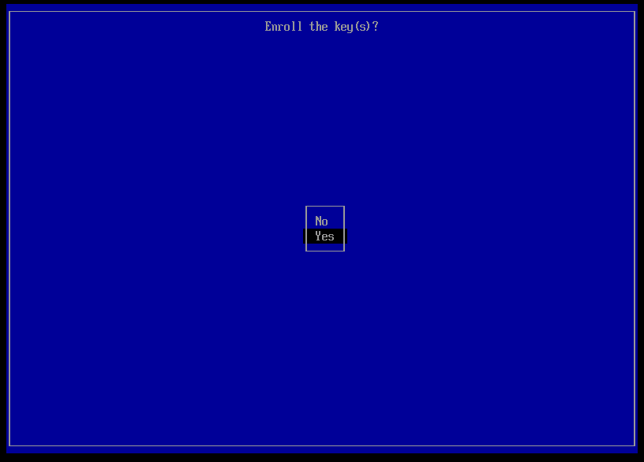

1. After the a warning related to secure boot appears, press `ENTER`.

	
2. When the countdown appears, press any key to continue.

	
3. Use the arrow keys to select **Enroll key from disk** and press `ENTER`.

	
4. Find the `solus-enroll-me.cer` file.

	Use the arrow keys to select a directory, `ENTER` open directories and `ESC` to go up one level.

	
5. When you locate the `solus-enroll-me.cer`, press `ENTER`.
6. In the confirmation screen, use the arrow keys select **YES** and press `ENTER`.

	

This is a one-time procedure. You don't need to enroll the certificate again.